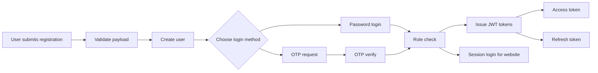
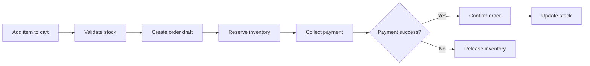
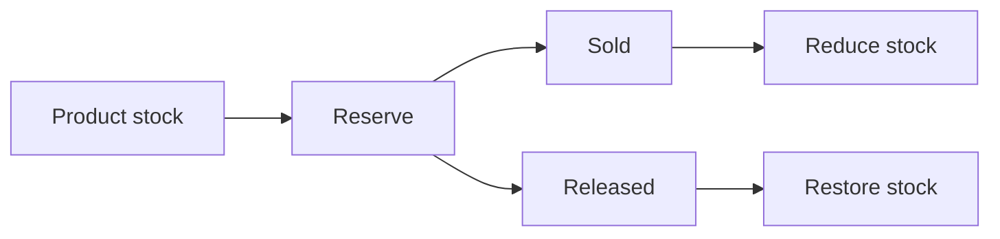

# Production-Ready Multi-Vendor E-Commerce Platform

Backend foundation for a multi-vendor e-commerce platform built with Django and Django REST Framework.

This repository currently provides the project scaffold, core data model, authentication backbone, API schema/docs, and deployment-ready settings structure. The goal is to grow this into a platform that can power:

- Website
- Android app
- iOS app
- Admin dashboard
- Third-party integrations

## Current Status

The codebase now includes:

- A Django project configuration with development and production settings
- A custom email-based user model
- Core address management
- Initial catalog, cart, orders, and seller domain models
- Health-check and API root endpoints
- JWT authentication endpoints
- OpenAPI schema and Swagger UI
- A mobile-first server-rendered storefront with templates and responsive UI
- Promotional banners, sale sections, product cards, cart, checkout, account, seller, and product detail screens
- Browser sign-in, logout, OTP login, role-aware seller/admin login, and JWT auth endpoints
- Live cart, checkout, payment selection, and printable receipt flow
- Post-delivery review, photo upload, and return-request flow

This is a strong starting point, but no production system can honestly be promised to have "no bugs" or "never crash". What we can do is build it with clear boundaries, tests, logging, secure defaults, and deployment patterns that keep failures rare and visible.

### Completed in Auth Phase 1

- Customer login and logout
- Seller login
- Admin login
- Email OTP login
- JWT login and refresh for API/mobile use
- Role-aware redirects after login
- Authentication-protected account and seller dashboard pages
- Auth documentation updated alongside the code

### Completed in Checkout Phase 2

- Database-backed cart state for the web storefront
- Address-based checkout for logged-in users
- Provider-aware payment step for Razorpay, Stripe, and cash on delivery
- Order creation, payment record creation, and receipt generation
- Cart clearing after payment capture
- Printable invoice and tracking handoff

### Completed in Customer Lifecycle Phase 3

- Customer review submissions after delivery
- Product photo uploads with reviews
- Return requests within the delivery window
- Settlement hold until the return window closes
- Seller payout release timing displayed on the dashboard and tracking pages

---

## Project Goal

Build a professional e-commerce platform similar to Amazon, Flipkart, or Meesho using Django and Django REST Framework.

The backend is structured so the same API can support:

- Web storefront
- Seller dashboard
- Admin tools
- Mobile applications

---

## Development Roadmap

### Phase 1 - Project Setup

- Python
- Virtual environment
- Django
- PostgreSQL
- Git
- Docker optional
- Environment variables

### Phase 2 - Authentication

- Registration
- OTP verification
- Login
- Logout
- Password reset
- JWT authentication

### Phase 3 - Customer Features

- Profile
- Address management
- Cart
- Wishlist
- Checkout
- Orders

### Phase 4 - Seller Features

- Seller registration
- Business details
- Product management
- Inventory
- Order management

### Phase 5 - Admin

- User management
- Seller approval
- Product approval
- Reports
- Analytics

### Phase 6 - Production

- Security
- Performance
- Caching
- Logging
- Monitoring

---

## Folder Structure

```text
.
├── apps/
│   ├── accounts/
│   │   Custom user model, addresses, and JWT auth endpoints.
│   ├── cart/
│   │   Cart and cart item models.
│   ├── catalog/
│   │   Products, categories, brands, images, and inventory movement logs.
│   ├── core/
│   │   Shared utilities, base model, and API health/root endpoints.
│   ├── website/
│   │   Frontend views and storefront routes.
│   ├── orders/
│   │   Orders, order items, and payment records.
│   └── sellers/
│       Seller profile and approval lifecycle.
├── config/
│   ├── settings/
│   │   Base, development, and production settings.
│   ├── asgi.py
│   ├── urls.py
│   └── wsgi.py
├── docs/
│   Reserved for architecture notes, diagrams, and implementation docs.
├── media/
│   Uploaded user, product, and brand files.
├── static/
│   Frontend CSS, JavaScript, icons, and images.
├── templates/
│   Server-rendered storefront templates.
├── manage.py
├── requirements.txt
└── README.md
```

Folder intent:

- `apps/accounts/` stores identity, profile, and address concerns.
- `apps/catalog/` stores product, category, brand, and inventory metadata.
- `apps/cart/` stores active shopping sessions and line items.
- `apps/orders/` stores order placement, payment, and fulfillment state.
- `apps/sellers/` stores seller onboarding and approval state.
- `apps/core/` stores shared building blocks that the rest of the project can depend on safely.
- `apps/website/` stores the storefront pages, including home, shop, offers, account, seller, product detail, cart, and checkout.
- `config/settings/` separates development and production concerns cleanly.
- `media/` is for uploaded files and should never be committed.
- `static/` is for source static assets before collection.
- `staticfiles/` is the production collectstatic output directory.

---

## Installation

### Clone Repository

```bash
git clone <repo-url>
cd "E-Commerce Site"
```

### Create Virtual Environment

```bash
python -m venv .venv
.\.venv\Scripts\Activate.ps1
```

If PowerShell blocks activation, run:

```powershell
Set-ExecutionPolicy -Scope Process Bypass
```

### Install Requirements

```bash
pip install -r requirements.txt
```

### Configure `.env`

Copy `.env.example` to `.env` and update the values.

### Apply Migrations

```bash
python manage.py makemigrations
python manage.py migrate
```

### Create Superuser

```bash
python manage.py createsuperuser
```

### Run Development Server

```bash
python manage.py runserver
```

Open:

- `http://127.0.0.1:8000/api/`
- `http://127.0.0.1:8000/api/health/`
- `http://127.0.0.1:8000/api/docs/`
- `http://127.0.0.1:8000/admin/`
- `http://127.0.0.1:8000/auth/login/`
- `http://127.0.0.1:8000/auth/login/seller/`
- `http://127.0.0.1:8000/auth/login/admin/`
- `http://127.0.0.1:8000/auth/otp/`
- `http://127.0.0.1:8000/auth/otp/seller/`
- `http://127.0.0.1:8000/auth/otp/admin/`

---

## Environment Variables

| Variable | Why it exists |
| --- | --- |
| `DEBUG` | Enables or disables development-only behavior. |
| `SECRET_KEY` | Django cryptographic signing and session security. |
| `ALLOWED_HOSTS` | Protects against hostile host header usage. |
| `DB_ENGINE` | Lets the same code run on SQLite, PostgreSQL, or MySQL. |
| `DB_NAME` | Database name or SQLite file path. |
| `DB_USER` | Database username for server databases. |
| `DB_PASSWORD` | Database password for server databases. |
| `DB_HOST` | Database server host. |
| `DB_PORT` | Database server port. |
| `CSRF_TRUSTED_ORIGINS` | Trusted origins for browser form and API requests. |
| `CORS_ALLOWED_ORIGINS` | Allowed origins for frontend applications. |
| `EMAIL_BACKEND` | SMTP backend or console backend during development. |
| `DEFAULT_FROM_EMAIL` | Default sender address for notifications. |
| `TIME_ZONE` | Application timezone. |
| `LANGUAGE_CODE` | Default language locale. |
| `SECURE_SSL_REDIRECT` | Forces HTTPS in production when supported. |

Example `.env`:

```env
DEBUG=True
SECRET_KEY=replace-me
ALLOWED_HOSTS=127.0.0.1,localhost
DB_ENGINE=django.db.backends.sqlite3
DB_NAME=dev.sqlite3
EMAIL_BACKEND=django.core.mail.backends.console.EmailBackend
DEFAULT_FROM_EMAIL=no-reply@example.com
TIME_ZONE=Asia/Kolkata
LANGUAGE_CODE=en-us
```

---

## Database

The project supports three common database choices through `DB_ENGINE`.

### PostgreSQL

Recommended for production.

Use:

```env
DB_ENGINE=django.db.backends.postgresql
DB_NAME=ecommerce
DB_USER=ecommerce_user
DB_PASSWORD=strong-password
DB_HOST=127.0.0.1
DB_PORT=5432
```

Why PostgreSQL:

- Strong concurrency support
- Good indexing and query planning
- Excellent fit for transactional commerce systems

### MySQL

Also supported if your hosting provider prefers it.

Use:

```env
DB_ENGINE=django.db.backends.mysql
DB_NAME=ecommerce
DB_USER=ecommerce_user
DB_PASSWORD=strong-password
DB_HOST=127.0.0.1
DB_PORT=3306
```

### SQLite

Good for quick local development.

Use:

```env
DB_ENGINE=django.db.backends.sqlite3
DB_NAME=dev.sqlite3
```

SQLite is convenient, but it is not the best choice for production traffic or many concurrent writes.

---

## Static Files

Static files are versioned assets such as CSS, JS, and logo files.

- During development, Django serves files from `static/`
- In production, run `python manage.py collectstatic`
- The collected output lands in `staticfiles/`

Why `collectstatic` matters:

- It gathers static assets from all apps into one deployable location
- Web servers like Nginx can serve them efficiently
- It keeps application code and web assets separate

---

## Media Files

Media files are user-generated uploads:

- Product images
- Brand logos
- User avatars
- Seller documents

Local development uses `media/`.

Production deployments should store media on:

- VPS disk storage for small installations
- Shared storage
- Object storage such as S3 for scalable deployments

---

## API Documentation

Current endpoints:

| Method | Path | Purpose |
| --- | --- | --- |
| `GET` | `/api/` | API root |
| `GET` | `/api/health/` | Health check |
| `GET` | `/api/schema/` | OpenAPI schema |
| `GET` | `/api/docs/` | Swagger UI |
| `POST` | `/api/auth/register/` | Register a user |
| `GET` | `/api/auth/me/` | Current user profile |
| `PUT/PATCH` | `/api/auth/me/` | Update current user profile |
| `POST` | `/api/auth/login/` | Role-aware JWT login |
| `POST` | `/api/auth/jwt/create/` | Login alias for compatibility |
| `POST` | `/api/auth/jwt/refresh/` | Refresh JWT |
| `POST` | `/api/auth/logout/` | Blacklist a refresh token |
| `POST` | `/api/auth/otp/request/` | Request an OTP login code |
| `POST` | `/api/auth/otp/verify/` | Verify OTP and receive JWT tokens |
| `GET/POST` | `/api/auth/addresses/` | List and create addresses |
| `GET/PATCH/DELETE` | `/api/auth/addresses/{id}/` | Address detail |

Planned endpoints will be documented as each module is completed.

---

## Authentication Flow



Current implementation supports:

- Account registration
- Password login and logout
- Role-aware customer, seller, and admin sign-in
- OTP request and OTP verification
- JWT login and refresh
- Authenticated profile access
- Address management

Future phases will add:

- Password reset
- Better session handling for remember-me and login throttling
- Two-factor and recovery options

---

## Checkout Flow



Checkout should eventually enforce:

- Inventory reservation before payment capture
- Payment failure recovery
- Order status transitions
- Stock release on cancellation or timeout

---

## Inventory Flow



The `InventoryMovement` model is included so we can audit:

- Reserved quantities
- Released quantities
- Sold quantities
- Manual adjustments

That gives us a reliable audit trail instead of only storing a final stock number.

---

## Deployment Guides

### Local Development

1. Create a virtual environment.
2. Install requirements.
3. Create `.env`.
4. Run `makemigrations` and `migrate`.
5. Create a superuser.
6. Run `python manage.py runserver`.

### Hostinger VPS

1. Provision the VPS.
2. Install Python, pip, venv, PostgreSQL or MySQL, and Nginx.
3. Clone the repository.
4. Configure the `.env` file.
5. Create the database and user.
6. Install dependencies inside a virtual environment.
7. Run migrations and collectstatic.
8. Serve the app with Gunicorn.
9. Reverse proxy through Nginx.
10. Add SSL with Let’s Encrypt.

### PythonAnywhere

1. Upload or clone the code.
2. Create a virtualenv.
3. Install dependencies.
4. Configure WSGI entrypoint.
5. Set environment variables in the web app panel.
6. Run migrations.
7. Configure static and media mappings.

### cPanel

1. Enable the Python app feature.
2. Upload the project files.
3. Create the virtualenv.
4. Install dependencies.
5. Configure environment variables.
6. Set the WSGI/startup file.
7. Run migrations and collectstatic.

### Heroku

1. Prepare the app for a 12-factor deployment.
2. Add a PostgreSQL addon.
3. Set config vars.
4. Use Gunicorn as the web process.
5. Run migrations on release.
6. Configure static file serving.

### AWS EC2

1. Launch the instance.
2. Secure SSH access and update packages.
3. Install Python, PostgreSQL, and Nginx.
4. Clone the repository.
5. Set up a virtualenv.
6. Configure Gunicorn as a systemd service.
7. Configure Nginx reverse proxy.
8. Add HTTPS with Certbot.

### Docker

1. Build an application image.
2. Run the app container with environment variables.
3. Run a database container if needed.
4. Use volume mounts for media files.
5. Use a reverse proxy container or host Nginx.

Common deployment items for every guide:

- Creating the server
- Installing dependencies
- Environment variables
- Database setup
- Static files
- Media files
- Gunicorn
- Nginx
- HTTPS
- Domain setup
- SSL
- Restarting services
- Updating the application

---

## Testing

Run tests with:

```bash
python manage.py test
```

Recommended test areas:

- Health endpoint
- User registration
- Cart calculations
- Order totals
- Inventory movement logic

---

## Common Errors

### `ModuleNotFoundError: No module named 'django'`

Install dependencies:

```bash
pip install -r requirements.txt
```

### `ImproperlyConfigured: AUTH_USER_MODEL refers to model that has not been installed`

Make sure `apps.accounts` is installed and migrations are created before running auth-related code.

### `OperationalError: no such table`

Run migrations:

```bash
python manage.py makemigrations
python manage.py migrate
```

### `DisallowedHost`

Add the domain or host to `ALLOWED_HOSTS`.

### Static files not loading

Run `collectstatic` in production and make sure Nginx or WhiteNoise is serving the result.

---

## Future Improvements

- OTP verification and password reset flows
- Wishlist module
- Seller dashboard APIs
- Inventory reservation timeouts
- Coupon and promotion engine
- Live Razorpay and Stripe credentials in `.env`
- Shipping provider integrations
- Notification service
- Audit logs
- Review moderation workflows
- Caching with Redis
- Background tasks with Celery
- Rate limiting and abuse prevention
- Full admin analytics

---

## Changelog

### 0.1.0

- Created the Django project scaffold
- Added a custom user model and addresses
- Added initial catalog, cart, order, seller, and inventory models
- Added API health and root endpoints
- Added JWT and schema documentation endpoints
- Added production-oriented settings layout
